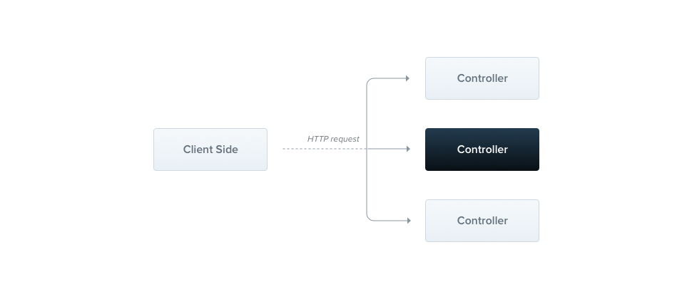

# Nest Controller

  


```ts
import { Injectable, CanActivate, ExecutionContext } from '@nestjs/common'
import { Observable } from 'rxjs'

@Injectable()
export class AuthGuard implements CanActivate {
  // 必须实现
  canActivate(
    context: ExecutionContext,
  ): boolean | Promise<boolean> | Observable<boolean> {
    const request = context.switchToHttp().getRequest()
    // 业务逻辑
    return validateRequest(request)
  }
}
```

## 使用

```ts
// method 1. 类
@Controller('cats')
@UseGuards(RolesGuard)
export class CatsController {}

// method 2. 实例
@Controller('cats')
@UseGuards(new RolesGuard())
export class CatsController {}

// method 3. 全局
const app = await NestFactory.create(AppModule);
app.useGlobalGuards(new RolesGuard());
```