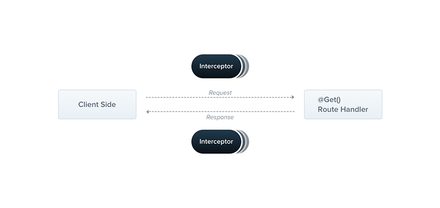

# Nest Interceptor

拦截器是一个被 `@Injectable()` 装饰的类

  

## 作用
1. bind extra logic before / after method execution
2. transform the result returned from a function
3. transform the exeception thrown from a function
4. extend the basic function behavior
5. completely override a function depending on specific conditions

## 基本实现
```ts
// logging.interceptor.ts
import {
  CallHandler,
  ExecutionContext,
  Injectable,
  NestInterceptor
} from '@nestjs/common'
import { Observable } from 'rxjs'
import { tap } from 'rxjs/operators'

@Injectable()
export class LoggingInterceptor implements NestInterceptor {
  // 必须要实现 intercept 方法
  // ExecutionContext（请求上下文） <- ArgumantsHost
  intercept(context: ExecutionContext, next: CallHandler): Observable<any> {
    console.log('Before...')
    const now = Date.now()
    // handle 是具体路由处理方法
    return next
      .handle()
      .pipe(tap(() => console.log(`After...${Date.now() - now}ms`)))
  }
}
```

## 使用
```ts
//app.controller.ts
import {
  Controller,
  Get
} from '@nestjs/common'
import { LoggingInterceptor } from '../interceptors/logging.interceptor.ts'

// method 1，控制器级别
@Controller()
@UseInterceptor(LoggingInterceptor)
export class AppController {
  //...
}

// method 2，控制器级别
//app.controller.ts
@Controller()
@UseInterceptor(new LoggingInterceptor())
export class AppController {
  //...
}

// method 3，方法级别
//app.controller.ts
@Controller()
export class AppController {
  @UseInterceptor(new LoggingInterceptor())
  @Get('route')
  findAll() {
    //...
  }
  //...
}

// method 4，方法级别
@Controller()
export class AppController {
  @UseInterceptor(LoggingInterceptor)
  @Get('route')
  findAll() {
    //...
  }
  //...
}

// method 5，全局拦截器
// main.ts
async function bootstrap () {
  const app = await NestFactory.create(AppModule)
  app.useGlobalInterceptor(new LoggingInterceptor())
  //...
}
```
拦截器执行顺序：
  全局拦截器1（自上而下）begin -> 
    全局拦截器2 begin -> 
      控制器拦截器2（自下而上）begin -> 
        控制器拦截器1 begin -> 
          方法拦截器2（自下而上）begin -> 
            方法拦截器1 begin ->
              ...
            方法拦截器1 end -> 
          方法拦截器2 end -> 
        控制器拦截器1 end -> 
      控制器拦截器 2 end -> 
    全局拦截器2 end -> 
  全局拦截器1 end

## 参考文档
- [https://docs.nestjs.com/interceptors#interceptors](https://docs.nestjs.com/interceptors#interceptors)